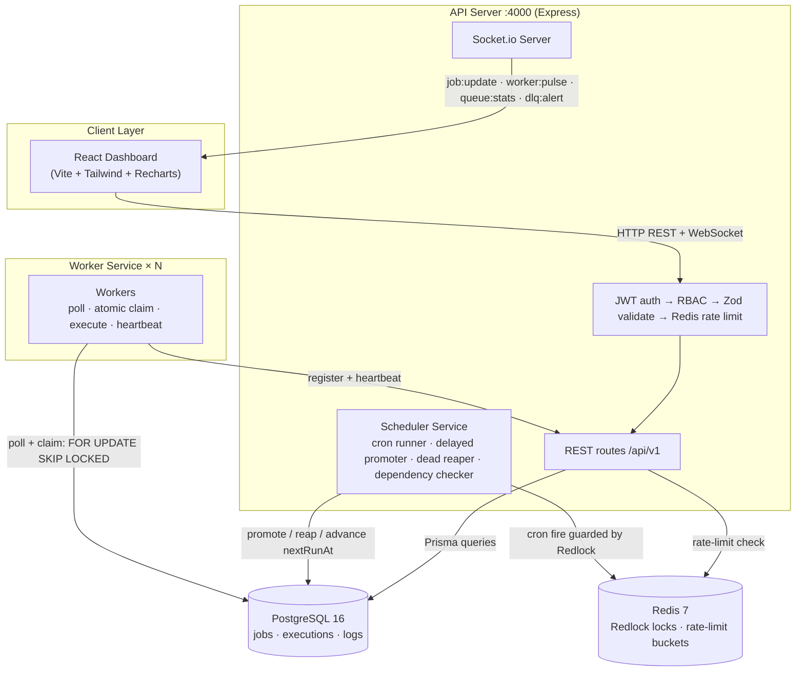

# JobScheduler — Distributed Job Scheduling Platform

Production-inspired distributed job scheduling platform: PostgreSQL-backed durable queues with **atomic job claiming** (`FOR UPDATE SKIP LOCKED`), retries with backoff strategies, a dead-letter queue, cron scheduling, event-driven triggers, workflow dependencies, queue sharding, rate limiting, WebSockets, and a real-time React dashboard.

> ✅ **34/34 tests passing** across 6 suites — including concurrent-claiming race tests that prove no job is ever claimed twice.

<p align="center">
  
  &nbsp;
  
</p>
<p align="center">
  
</p>

## Architecture



## Features

### Core

- ✅ **Auth & project management** — JWT auth with refresh rotation, orgs → projects → queues under server-side RBAC
- ✅ **Queue configuration** — priority, concurrency limits, retry policy, pause/resume, live statistics
- ✅ **Job types** — immediate, delayed (`runAt`), scheduled/recurring (cron), batch, dependency workflows, idempotency keys
- ✅ **Worker service** — polling, atomic claiming, bounded concurrent execution, heartbeats, graceful shutdown
- ✅ **Complete job lifecycle** — Queued → Scheduled → Claimed → Running → Completed, with retries and DLQ for permanent failures
- ✅ **Retry strategies** — FIXED / LINEAR / EXPONENTIAL backoff with jitter and per-queue policies
- ✅ **Execution observability** — per-attempt execution logs, retry history, worker assignment, timestamps, metrics
- ✅ **Web dashboard** — manage queues, inspect jobs, monitor workers, retry failures, visualize throughput and health
- ✅ **Relational schema** — full ERD with PKs, FKs, indexes, normalization, cascading, and performance rationale ([docs/erd.md](docs/erd.md))
- ✅ **REST APIs** — validation, authentication, pagination, filtering, structured errors, logging
- ✅ **Atomic claiming + idempotency** — `FOR UPDATE SKIP LOCKED` proven by race tests
- ✅ **Responsive dashboard with live updates**

### Bonus

- ✅ **Workflow dependencies** — `dependsOn` enforced atomically inside the claim SQL
- ✅ **Rate limiting** — Redis sliding-window token bucket (API-level per user, queue-level config)
- ✅ **Distributed locking** — Redlock around cron firing across API instances
- ✅ **Queue sharding** — shard keys on queues/workers, honored by the claim query
- ✅ **Event-driven execution** — `POST /events` fires triggers with `{{event.field}}` payload templates
- ✅ **WebSocket live updates** — JWT-authenticated Socket.io rooms
- ✅ **RBAC** — OWNER / ADMIN / MEMBER / VIEWER hierarchy checked server-side
- ✅ **AI failure summaries** — optional async OpenRouter analysis on DLQ entries

## Tech Stack

| Layer | Technologies |
|---|---|
| Backend | Node.js 20, TypeScript, Express, Socket.io, node-cron |
| Data | PostgreSQL 16, Prisma ORM, Redis 7 (ioredis + Redlock) |
| Validation & auth | Zod, JWT (jsonwebtoken), bcrypt |
| Frontend | React 18, Vite, TailwindCSS, Zustand, Recharts |
| Observability | Winston structured logging |
| Testing | Jest + Supertest |

---

## Quick start

### Prerequisites

- Node.js ≥ 20, pnpm ≥ 9 (`npm i -g pnpm`)
- Docker (for the one-command stack) *or* local PostgreSQL 15+/Redis 7

### Option A — everything in Docker

```bash
cp .env.example .env          # adjust JWT secrets etc.
docker compose up --build -d  # postgres, redis, api, 2× worker, web
docker compose exec api pnpm exec prisma migrate deploy
docker compose exec api node dist/prisma/seed.js   # demo data (see note)
```

Web → http://localhost:3000 · API → http://localhost:4000/health

> Note: the seed script runs from source. In the containerized build use:
> `pnpm install && pnpm db:seed` from the host against the exposed Postgres, or run it before building.

### Option B — local development

```bash
# 1. Infra only
docker compose up postgres redis -d
# …or point DATABASE_URL / REDIS_URL at existing services in .env

# 2. Install & migrate & seed
pnpm install
pnpm db:migrate        # prisma migrate deploy (creates schema)
pnpm db:generate       # prisma client
pnpm db:seed           # demo user/org/project/queues/jobs/schedule/trigger

# 3. Run everything (three terminals or one command)
pnpm dev               # api :4000 + first worker
pnpm dev:worker        # additional workers (run multiple for concurrency demos)
pnpm dev:web           # dashboard http://localhost:5173
```

**Demo credentials** (after seeding): `demo@jobscheduler.dev` / `demo1234` (OWNER) · `viewer@jobscheduler.dev` / `demo1234` (VIEWER — RBAC demo)

## Project structure

```
.
├── apps/
│   ├── api/                 # Express REST API + scheduler loops + Socket.io
│   │   ├── prisma/          # schema.prisma, migrations, seed
│   │   └── src/
│   │       ├── db/queries/  # atomic claim query (FOR UPDATE SKIP LOCKED)
│   │       ├── routes/      # versioned /api/v1 route handlers
│   │       ├── services/    # scheduler loops, lifecycle, RBAC, metrics
│   │       └── tests/       # Jest + Supertest suite (34 tests)
│   ├── web/                 # React dashboard (Vite + Tailwind + Zustand)
│   └── worker/              # standalone worker process (claim loop, executor)
├── packages/shared/         # shared types, constants, validation
├── docs/                    # architecture, ERD, API reference, decisions…
├── docker-compose.yml       # postgres + redis + api + workers + web
└── .env.example             # all configuration, documented
```

## Database Schema

17 relational tables managed by Prisma (users, organizations, org_members, projects, queues, jobs, job_dependencies, batch_jobs, job_executions, job_logs, retry_policies, workers, worker_heartbeats, scheduled_jobs, dead_letter_queue, event_triggers, events) — uuid primary keys, ownership chains that CASCADE on delete while historical references SET NULL, and composite indexes justified query-by-query. Full diagram and index rationale: [`docs/erd.md`](docs/erd.md).

## The atomic claim query

Duplicate execution is impossible not because of application coordination but because of one PostgreSQL statement:

```sql
WITH eligible AS (
  SELECT j.id FROM jobs j
  WHERE j.status = 'PENDING'
    AND (j.run_at IS NULL OR j.run_at <= (NOW() AT TIME ZONE 'UTC'))
    AND NOT EXISTS (           -- dependencies must be COMPLETED
      SELECT 1 FROM job_dependencies jd
      JOIN jobs dep ON dep.id = jd.dependency_job_id
      WHERE jd.dependent_job_id = j.id AND dep.status != 'COMPLETED')
  ORDER BY j.priority DESC, j.created_at ASC
  LIMIT $1
  FOR UPDATE OF j SKIP LOCKED   -- ← the whole trick
)
UPDATE jobs SET status = 'CLAIMED', claimed_at = NOW(), worker_id = $2
WHERE id IN (SELECT id FROM eligible)
RETURNING *;
```

`FOR UPDATE` takes row-level locks on candidate jobs; `SKIP LOCKED` tells each competing worker to *skip* rows another worker is currently claiming instead of waiting — so N concurrent pollers diverge onto different jobs with zero waits, zero deadlocks, and zero double-execution. See [`apps/api/src/db/queries/claimJobs.ts`](apps/api/src/db/queries/claimJobs.ts) for the fully annotated query.

## Retry strategies

| Strategy | Formula | Example (1 s initial, ×2) | Best for |
|---|---|---|---|
| `FIXED` | `initialDelayMs` | 1s, 1s, 1s… | transient, evenly-spaced blips |
| `LINEAR` | `initialDelayMs × attempt` | 1s, 2s, 3s… | gentle ramp on repeated failure |
| `EXPONENTIAL` | `initialDelayMs × multiplier^(attempt−1)` (+ ±10% jitter) | 1s, 2s, 4s, 8s… | outages/overload recovery |

All delays are capped at `maxDelayMs`.

## Scripts

| Command | Purpose |
|---|---|
| `pnpm dev` | API + one worker (dev, ts-node-dev) |
| `pnpm dev:api` / `dev:worker` / `dev:web` | individual services |
| `pnpm build` | typecheck-build all packages |
| `pnpm test` | API test suite (needs PG + Redis up) |
| `pnpm typecheck` | strict TS across all packages |
| `pnpm db:migrate` / `db:generate` / `db:seed` | Prisma tasks |

## Try the end-to-end flow

```bash
TOKEN=$(curl -s -X POST localhost:4000/api/v1/auth/login \
  -H 'Content-Type: application/json' \
  -d '{"email":"demo@jobscheduler.dev","password":"demo1234"}' | jq -r .data.accessToken)

QUEUE=$(… # queue id from GET /orgs/acme/projects → queues)

# Create a failing job → watch retries → DLQ entry appears
curl -X POST localhost:4000/api/v1/queues/$QUEUE/jobs \
  -H "Authorization: Bearer $TOKEN" -H 'Content-Type: application/json' \
  -d '{"type":"email","payload":{"to":"x@example.com","forceFail":true},"maxAttempts":2}'

# Fire an event → trigger template → job created automatically
curl -X POST localhost:4000/api/v1/events \
  -H "Authorization: Bearer $TOKEN" -H 'Content-Type: application/json' \
  -d '{"name":"user.signed_up","payload":{"email":"a@b.c","name":"Alice"}}'
```

Open the dashboard to watch jobs move PENDING → RUNNING → COMPLETED live.

## Running Tests

```bash
pnpm test
```

**34/34 tests passing** across 6 suites. Highlights:

- **Concurrent claiming race test** — 10 simulated workers race for 1 job (and 5 workers for 20 jobs); exactly one claimer every time, proving `FOR UPDATE SKIP LOCKED`
- Dependency gating, delayed-`runAt` gating, paused queues
- Retry math (fixed/linear/exponential + jitter bounds)
- DLQ lifecycle, dead-worker recovery, sharding resolution, heartbeats, auth flows

## Documentation

- [Architecture](docs/architecture.md) — system diagram, job lifecycle, claim-query deep-dive
- [ERD](docs/erd.md) — full entity-relationship diagram with index rationale
- [API Reference](docs/api.md) — complete endpoint reference with request/response examples
- [Design Decisions](docs/design-decisions.md) — the why behind the seven major architectural trade-offs
- [Implementation Status](docs/implementation-status.md) — problem-statement checklist
- [Postman collection](docs/jobscheduler.postman_collection.json) — importable collection covering every endpoint

## Environment Variables

Copy `.env.example` to `.env` and fill in the values — every variable is documented inline there (database, Redis, JWT secrets, worker token, intervals, optional OpenRouter key for AI summaries).

## Troubleshooting

| Symptom | Fix |
|---|---|
| `P1001 can't reach database` | Postgres not running / wrong `DATABASE_URL`. Start `docker compose up postgres -d` |
| `Redis connection` errors at boot | Start redis: `docker compose up redis -d` |
| Jobs stuck PENDING | No worker running — start `pnpm dev:worker` |
| Worker exits `registration failed 401` | `WORKER_INTERNAL_TOKEN` differs between `.env` copies |
| No AI summaries in DLQ | Set `OPENROUTER_API_KEY` (free at openrouter.ai). Everything else works without it |
| Cron jobs never fire | API process must stay up; check `scheduled_jobs.next_run_at` and timezone validity |
