# Entity-Relationship Diagram

17-table relational schema (Prisma-managed, PostgreSQL).

```mermaid
erDiagram
    users ||--o{ org_members : "joins via user_id"
    organizations ||--o{ org_members : "has via org_id"
    organizations ||--o{ projects : "owns via org_id"
    projects ||--o{ queues : "contains via project_id"
    projects ||--o{ retry_policies : "defines via project_id"
    retry_policies |o--o{ queues : "default policy via retry_policy_id"
    retry_policies |o--o{ jobs : "override via retry_policy_id"
    queues ||--o{ jobs : "holds via queue_id"
    queues |o--o{ workers : "dedicated via queue_id"
    queues ||--o{ scheduled_jobs : "cron target via queue_id"
    queues ||--o{ dead_letter_queue : "dlq via queue_id"
    queues ||--o{ event_triggers : "trigger target via queue_id"
    queues ||--o{ batch_jobs : "batch scope via queue_id"
    jobs }o--|| queues : "belongs to"
    jobs |o--o| workers : "claimed by worker_id"
    jobs }o--o| batch_jobs : "member of parent_batch_id"
    jobs ||--o{ job_executions : "attempted via job_id (cascade)"
    jobs ||--o| dead_letter_queue : "dead letter via job_id (unique)"
    jobs |o--o| retry_policies : "uses"
    jobs ||--o{ job_dependencies : "waits on (dependent_job_id, cascade)"
    jobs ||--o{ job_dependencies : "blocks (dependency_job_id, cascade)"
    job_executions }o--|| jobs : "belongs to"
    job_executions |o--o| workers : "executed by worker_id"
    job_executions ||--o{ job_logs : "logged via execution_id (cascade)"
    workers ||--o{ worker_heartbeats : "pings via worker_id (cascade)"
    users |o--o{ workers : "registered by user_id"

    users {
        uuid id PK "default uuid()"
        varchar email UK "unique login identity"
        varchar password_hash "bcrypt(10) — never plaintext"
        varchar name
        timestamptz created_at
        timestamptz updated_at
    }
    organizations {
        uuid id PK
        varchar name
        varchar slug UK "unique URL-safe identifier"
        text description
    }
    org_members {
        uuid id PK
        uuid user_id FK "→ users.id CASCADE"
        uuid org_id FK "→ organizations.id CASCADE"
        enum role "OWNER | ADMIN | MEMBER | VIEWER"
        timestamptz joined_at
    }
    projects {
        uuid id PK
        uuid org_id FK "→ organizations.id CASCADE"
        varchar name
        varchar slug "unique per (org_id, slug)"
        text description
    }
    retry_policies {
        uuid id PK
        uuid project_id FK "→ projects.id CASCADE"
        varchar name
        enum strategy "FIXED | LINEAR | EXPONENTIAL"
        int max_attempts "1..100"
        int initial_delay_ms
        int max_delay_ms "backoff cap"
        float multiplier "exponential base"
    }
    queues {
        uuid id PK
        uuid project_id FK "→ projects.id CASCADE"
        varchar name
        varchar slug "unique per (project_id, slug)"
        int priority "1 low .. 10 critical (scheduling weight)"
        int concurrency_limit "queue-level cap"
        int rate_limit_per_min "NULL = unlimited"
        boolean is_paused "kill switch honored in claim SQL"
        uuid retry_policy_id FK "→ retry_policies.id SET NULL"
        varchar shard_key "NULL = unsharded"
    }
    jobs {
        uuid id PK
        uuid queue_id FK "→ queues.id CASCADE"
        varchar type "handler registry key"
        jsonb payload
        enum status "PENDING SCHEDULED CLAIMED RUNNING COMPLETED FAILED RETRYING CANCELLED DEAD"
        int priority "higher = claimed first"
        timestamptz run_at "NULL = immediate"
        timestamptz claimed_at
        timestamptz started_at
        timestamptz completed_at
        timestamptz failed_at
        uuid worker_id FK "→ workers.id SET NULL"
        int attempt_count "0-based; +1 recorded per failed attempt"
        int max_attempts
        uuid retry_policy_id FK "SET NULL"
        uuid parent_batch_id FK "→ batch_jobs.id SET NULL"
        varchar idempotency_key UK "duplicate submits return original job"
        int timeout_ms "per-execution timeout"
        jsonb metadata
        text_array tags
    }
    job_dependencies {
        uuid id PK
        uuid dependent_job_id FK "the waiting job → CASCADE"
        uuid dependency_job_id FK "must complete first → CASCADE"
    }
    batch_jobs {
        uuid id PK
        uuid queue_id FK "CASCADE"
        varchar name
        int total_jobs
        int completed_jobs "rolled up transactionally"
        int failed_jobs
        enum status "PENDING RUNNING COMPLETED PARTIAL_FAILURE FAILED"
    }
    job_executions {
        uuid id PK
        uuid job_id FK "one row per attempt → CASCADE"
        uuid worker_id FK "SET NULL if worker deleted"
        int attempt_number "1-based"
        timestamptz started_at
        timestamptz completed_at
        int duration_ms
        enum status "RUNNING COMPLETED FAILED TIMEOUT CANCELLED"
        text error
        text error_stack
        float memory_used_mb
    }
    job_logs {
        uuid id PK
        uuid execution_id FK "→ job_executions.id CASCADE"
        timestamptz timestamp
        enum level "DEBUG INFO WARN ERROR"
        text message
        jsonb metadata
    }
    workers {
        uuid id PK
        uuid queue_id FK "NULL = all eligible queues · SET NULL"
        varchar hostname
        int pid
        varchar version
        enum status "ACTIVE IDLE DEAD DRAINING"
        int concurrency "max parallel executions"
        timestamptz last_heartbeat "reaper threshold: 60s"
        timestamptz registered_at
        uuid user_id FK "optional owner · SET NULL"
        varchar shard_key "NULL = unsharded pool"
    }
    worker_heartbeats {
        uuid id PK
        uuid worker_id FK "→ workers.id CASCADE"
        timestamptz timestamp
        enum status "status at ping time"
        int jobs_running
        int jobs_done "cumulative counter"
        float memory_mb
        float cpu_percent
    }
    scheduled_jobs {
        uuid id PK
        uuid queue_id FK "target queue · CASCADE"
        varchar name
        varchar cron_expression "5-field cron, validated"
        varchar job_type "handler key for spawned jobs"
        jsonb job_payload "template payload for spawned jobs"
        int job_priority
        varchar timezone "IANA tz, default UTC"
        boolean is_active
        timestamptz next_run_at "cron runner scans this"
        timestamptz last_run_at
        uuid last_job_id "last spawned job (traceability)"
    }
    dead_letter_queue {
        uuid id PK
        uuid job_id FK,UK "1:1 with a dead job · CASCADE"
        uuid queue_id FK
        text reason
        timestamptz failed_at
        jsonb payload "snapshot at death"
        int attempts "attempts made when exhausted"
        text last_error
        text last_error_stack
        timestamptz resolved_at
        varchar resolved_by
        boolean is_resolved
        text ai_summary "OpenRouter failure analysis (async)"
    }
    event_triggers {
        uuid id PK
        uuid queue_id FK "where triggered jobs land · CASCADE"
        varchar event_name "matching key"
        varchar job_type
        jsonb job_payload_tmpl "{{event.field}} placeholders"
        int job_priority
        boolean is_active
    }
    events {
        uuid id PK
        varchar name
        jsonb payload
        varchar source
        timestamptz processed_at
        text_array triggered_job_ids "created job ids"
        timestamptz created_at
    }
```

## Design notes

- **Primary keys**: every table uses `uuid` v4 (`@default(uuid())`) — collision-free across independently created workers/instances.
- **Foreign keys & cascading**: ownership chains cascade (`org → project → queue → jobs → executions → logs`) so deleting an organization cleans up everything. References that describe *history* use `SET NULL` (`jobs.worker_id`, `queues.retry_policy_id`, `jobs.parent_batch_id`) so deleting a worker/policy/batch preserves the historical record without orphaning rows.
- **Normalization**: entities are separated along change-cadence lines — `jobs` (current state) vs `job_executions` (per-attempt history) vs `job_logs` (append-only stream); `worker_heartbeats` is a time-series split off from the mutable `workers` row to avoid hot-row update churn.
- **Performance considerations**: hot-path queries are covered by composite indexes (below); JSONB is used only for opaque payloads/metadata; `tags` and `triggered_job_ids` use native arrays; heartbeat/log volume is bounded by retention-friendly append-only writes.

## Index rationale

| Index | Table | Query it serves |
|---|---|---|
| `(queue_id, status, priority, run_at)` | jobs | **The poll index** — worker claim query filters by queue + PENDING status and orders by priority DESC, created ASC. Covers selection + sort in one scan. |
| `(status, run_at)` | jobs | Delayed/retry promoter: find `SCHEDULED`/`RETRYING` jobs whose `run_at <= now`. |
| `(worker_id)` | jobs | Dead reaper: recover CLAIMED/RUNNING jobs owned by a just-marked-DEAD worker; also worker detail views. |
| `(parent_batch_id)` | jobs | Batch roll-up counters (`completedJobs`/`failedJobs`) after each completion/failure. |
| `(tags)` | jobs | GIN-backed tag filtering in the job explorer (`?tags=digest,email`). |
| `(created_at)` | jobs | Time-range filters (`from`/`to`) and newest-first default sort. |
| `(dependent_job_id)` / `(dependency_job_id)` | job_dependencies | Both directions of dependency traversal: claim-time NOT EXISTS gate and "what does this block". |
| `(project_id, slug)` UK / `(org_id, slug)` UK / `(user_id, org_id)` UK | queues / projects / org_members | Uniqueness constraints double as lookup indexes for slug routing and membership checks. |
| `(queueId, status)` | batch_jobs | Batch progress listing per queue. |
| `(jobId)` / `(workerId)` / `(startedAt)` | job_executions | Execution history per job; per-worker history; time-window metrics aggregation. |
| `(execution_id, timestamp)` | job_logs | Ordered log streaming for one attempt (log accordion). |
| `(level)` | job_logs | Filter error-only log lines. |
| `(queue_id, status)` | workers | Fleet views scoped to a queue's dedicated workers. |
| `(status, last_heartbeat)` | workers | Dead-worker detection: `ACTIVE/IDLE AND last_heartbeat < cutoff`. |
| `(worker_id, timestamp)` | worker_heartbeats | Time-series heartbeat history chart on worker detail. |
| `(is_active, next_run_at)` | scheduled_jobs | Cron runner: due-schedule scan (`isActive = true AND nextRunAt <= now`). |
| `(queue_id)` | scheduled_jobs | Schedule list per queue page. |
| `(job_id)` UK | dead_letter_queue | Enforces 1:1 job↔entry; DLQ detail lookups by job. |
| `(queue_id, is_resolved)` | dead_letter_queue | DLQ dashboard filter: unresolved entries for one queue. |
| `(failed_at)` | dead_letter_queue | Newest-first DLQ ordering. |
| `(event_name, is_active)` | event_triggers | Event fire path: match active triggers for a fired event name. |
| `(name, created_at)` / `(processed_at)` | events | Event history filtering/pagination; find unprocessed events. |
